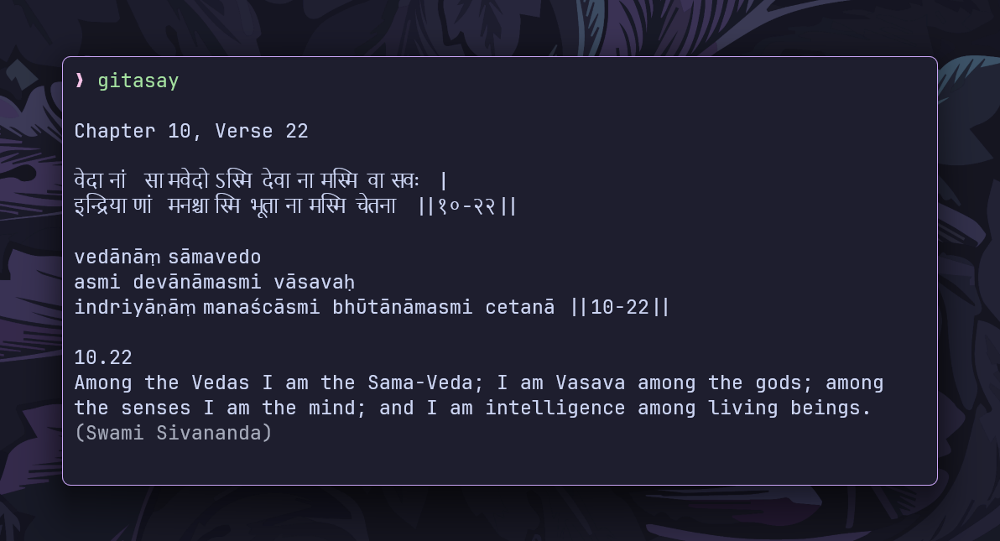

<h1 align="center">gitasay</h1>

<p align="center">
Simple command-line tool that displays verses (shlokas) from the
Bhagavad Gita, <br> complete with Sanskrit, transliteration, and
multiple scholarly translations ~ right in your terminal
</p>

<div align="center">

</div>

---

## Overview

`gitasay` brings the wisdom of the Bhagavad Gita to your terminal. Whether you
want daily inspiration or to explore specific verses, `gitasay` makes it easy to
access this rich, ancient, and timeless spiritual discourse.

Inspired by the classic Unix `fortune` command, which displays a random quote or
wisdom saying each time it's run. `gitasay` follows the same principle but
focuses specifically on the Bhagavad Gita, providing a spiritual dimension to
the terminal experience.

The program embeds a JSON collection of Bhagavad Gita verses obtained from the
[Vedic Scriptures API](https://vedicscriptures.github.io/).

## Features

- Displays random or specific verses from the Bhagavad Gita
- Shows original Sanskrit text and transliteration
- Support for multiple translation source
- View chapter information and summaries
- Text wrapping for improved readability in terminals
- Embedded JSON database (no internet connection required after installation)

## Installation

### Prerequisites

- Go 1.16 or later (for embedding functionality)

### Building from source

```bash
git clone https://github.com/ashish0kumar/gitasay.git
cd gitasay
go build -o gitasay
```

After building, add the executable to your `PATH` to run it from anywhere.

### Installing globally

```bash
go install github.com/ashish0kumar/gitasay@latest
```

## Usage

### Display a random verse

```bash
gitasay
```

### Display a specific verse

```bash
gitasay -c 2 -v 47
```

Shows Chapter 2, Verse 47 of the Bhagavad Gita.

### Show chapter information

```bash
gitasay -chapter-info
```

### Change translation source

```bash
gitasay -translation purohit
```

### List available translators

```bash
gitasay -list-translators
```

Available translators:

- `siva` (default)
- `purohit`
- `adi`
- `san`
- `tej`
- `chinmay`

## Data Source

All Bhagavad Gita verses and translations are sourced from the
[Vedic Scriptures API](https://vedicscriptures.github.io/). The data was fetched
and converted to a local JSON format using a separate Go program.

## Acknowledgements

- Thanks to [Vedic Scriptures API](https://vedicscriptures.github.io/) for
  providing the Bhagavad Gita data

<br>

<p align="center">
	
</p>

<p align="center">
        <i><code>&copy 2025-present <a href="https://github.com/ashish0kumar">Ashish Kumar</a></code></i>
</p>

<div align="center">
<a href="https://github.com/ashish0kumar/gitasay/blob/main/LICENSE"></a>&nbsp;&nbsp;
</div>
